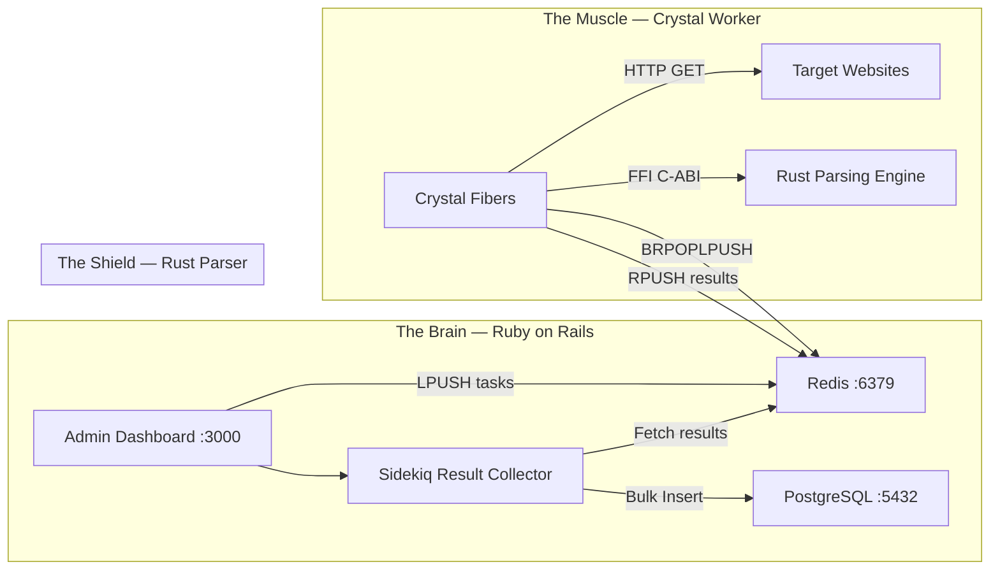

# Kalubampa

*Web crawling* dan ekstraksi data yang dirancang menggunakan arsitektur **Polyglot Microservices**. Sistem ini disatukan oleh Message Broker (Redis) dan *Foreign Function Interface* (FFI) untuk mencapai performa dan konkurensi maksimal, serta keamanan memori yang tangguh.

Sebagai **Universal Schema-driven Crawler**, platform ini mampu mengekstrak berbagai domain data secara dinamis (seperti jurnal ilmiah, data akademik, e-commerce, otomotif, travel, portal berita, aktivitas aset dan Web3, pengadaan publik dan regulasi hukum, ketersediaan fasilitas, pelacakan logistik dan transportasi, statistik gaming dan esports, tiket dan event, pemantauan cuaca dan kebencanaan, tren media sosial dan forum diskusi, data finansial, direktori bisnis, bursa kerja, real estate, dll) dengan mendefinisikan **Dynamic JSON Schema** melalui Dasbor Admin.

---

## 1. Ringkasan Arsitektur

Sistem dibagi menjadi tiga komponen utama dengan perannya masing-masing yang dianalogikan sebagai **The Brain**, **The Muscle**, dan **The Shield**:



### Detail Komponen Utama

1. **The Brain: Ruby on Rails (PostgreSQL)**
   * **Fungsi:** Aplikasi monolitik modern penyedia Dasbor Admin, API Internal, manajemen *database* relasional, autentikasi, dan pengaturan jadwal (Cron/Sidekiq).
   * **Alasan Pemilihan:** Kecepatan pengembangan (*Developer Velocity*) dan ekosistem *ActiveRecord* yang sangat kuat untuk mengelola logika bisnis yang kompleks.

2. **The Muscle: Crystal (Kemal / Redis Worker)**
   * **Fungsi:** Mesin penggerak jaringan (*Network I/O*). Bertugas meluncurkan jutaan permintaan HTTP secara konkuren tanpa membebani sistem operasi menggunakan komponen *Crystal Fibers*.
   * **Alasan Pemilihan:** Sintaks yang elegan mirip Ruby tetapi dikompilasi (*Ahead-Of-Time* / AOT) ke bahasa mesin.

3. **The Shield & Scalpel: Rust (via C-ABI)**
   * **Fungsi:** Pembedah dan Pengekstrak HTML (*CPU Bound*). Membaca DOM HTML yang berantakan dan mencari data spesifik menggunakan Regex atau CSS Selectors.
   * **Alasan Pemilihan:** Kecepatan komputasi setara C/C++ serta memiliki *Borrow Checker* yang menjamin **Kekebalan terhadap Segfault / Buffer Overflow**. Sangat esensial untuk memproses teks acak dari internet yang berpotensi rusak (*malformed*).

---

## 2. Diagram Interaksi Sistem

Berikut adalah visualisasi aliran data dan interaksi antar-layanan dari UI pengguna hingga proses ekstraksi tingkat rendah:

```text
[ Admin Web UI ] <---(WebSockets)---> [ Ruby on Rails (Port 3000) ]
                                            |   ^
                         (Bulk Insert)      |   | (Fetch Results via Sidekiq)
                                            v   |
                                       [ PostgreSQL ]
                                            
                                       [ Redis Broker ]
                                (Port 6379 / In-Memory RAM)
                                      ^               ^
             (LPUSH Tasks)            |               |  (RPUSH Results)
             [ Rails ] ---------------+               +--- [ Crystal Workers ]
                                                                  |
                                                                  v (HTTP GET)
                                                           [ Target Websites ]
                                                                  |
                                                                  v (Raw HTML)
                                                          [ FFI Bridge (C-ABI) ]
                                                                  |
                                                                  v (Unsafe Pointers)
                                                          [ Rust Parsing Engine ]
```

---

## 3. Alur Kerja Penggunaan (User & System Workflow)

1. **Inisiasi Tugas oleh Pengguna (The Brain)**
   * Pengguna berinteraksi dengan antarmuka Dasbor Admin berbasis Ruby on Rails untuk membuat kampanye (beserta definisi konfigurasi *JSON Schema* untuk ekstraksi) dan menambahkan daftar URL target.
   * Rails memasukkan tugas-tugas tersebut secara massal (`LPUSH`) ke dalam antrean Redis Message Broker pada key `kalubampa:task_queue`. Payload yang dikirim merupakan **objek JSON** yang berisi target `url` beserta instruksi `schema_json` (bukan sekadar URL string mentah).

2. **Pemrosesan Jaringan secara Konkuren (The Muscle)**
   * **Fail-Safe Task Pickup:** Crystal Worker mengambil URL target dari Redis menggunakan perintah atomik `BRPOPLPUSH` untuk memindahkan tugas ke antrean pemrosesan yang aman demi mencegah hilangnya data jika *worker* tiba-tiba mati.
   * **Unduh HTML:** Crystal mengeksekusi *HTTP GET request* secara massal dan konkuren ke situs web target menggunakan *Fibers* untuk mengambil *raw HTML*.

3. **Ekstraksi Data Aman (The Shield)**
   * **Jembatan FFI:** Crystal mengirimkan data *raw HTML* **beserta** *JSON Schema* ke *Rust Parsing Engine* melalui jembatan FFI (*Foreign Function Interface*) dengan standar C-ABI (*Unsafe Pointers*). Crystal berinteraksi murni menggunakan tata letak C (Aturan Penyamaran).
   * **Pembedahan DOM Dinamis:** Rust membaca instruksi skema dan mengekstrak data dari HTML menggunakan CSS Selectors secara aman tanpa risiko *Segfault*, dan mengembalikan hasilnya dalam bentuk JSON *string*.
   * **Pembersihan Memori:** Setelah ekstraksi selesai dan data dikembalikan, Crystal memanggil fungsi pembersih khusus dari Rust (yaitu `free_json_string`) untuk menghancurkan memori JSON *string* yang dialokasikan di sisi Rust.

4. **Penyimpanan Massal & Hasil Akhir**
   * **Zona Isolasi Jaringan:** Crystal Worker tidak mengirim data langsung ke PostgreSQL atau Rails API. Hasil ekstraksi dikirim (`RPUSH`) kembali ke Redis `kalubampa:result_queue`.
   * **Result Collector:** *Sidekiq Worker* di sisi Rails mengambil data JSON dari `kalubampa:result_queue`.
   * **Bulk Insert:** Rails memproses data tersebut menggunakan metode ActiveRecord `insert_all` ke dalam PostgreSQL untuk *write-heavy throughput* berkecepatan tinggi. Hasil akhir langsung ditampilkan secara *real-time* di Dasbor Admin.

---

## 4. Struktur Direktori Monorepo

Proyek ini dikelola menggunakan struktur monorepo sebagai berikut:

```text
kalubampa/
├── dashboard/                 # [RUBY] Rails App (The Brain)
│   ├── app/
│   │   ├── controllers/
│   │   ├── models/
│   │   ├── jobs/              # Sidekiq Workers (Result Collector)
│   │   └── views/
│   ├── config/
│   └── Gemfile
├── worker/                    # [CRYSTAL] Concurrency App (The Muscle)
│   ├── src/
│   │   ├── kalubampa_worker.cr
│   │   ├── ffi_bindings.cr
│   │   ├── redis_client.cr
│   │   └── fetcher.cr
│   └── shard.yml
├── parser/                    # [RUST] HTML Extraction Engine (The Shield)
│   ├── src/
│   │   └── lib.rs
│   ├── include/
│   │   └── rust_parser.h
│   └── Cargo.toml
├── podman/                    # Infrastruktur & Konfigurasi Lingkungan
│   ├── podman-compose.yml
│   ├── Containerfile.rails
│   └── Containerfile.worker
└── Makefile
```

---

## 5. Infrastruktur Podman & Manajemen Layanan

Repo ini menggunakan **Podman** untuk mengorkestrasi seluruh dependensi dasar layanan dengan konfigurasi berikut:
* **PostgreSQL 16 Alpine:** Berperan sebagai database relasional utama yang dioptimalkan untuk performa penyimpanan masif (*write-heavy throughput*).
* **Redis 7 Alpine:** Berperan sebagai *in-memory message broker* yang menangani antrean `kalubampa:task_queue` dan `kalubampa:result_queue`.
* **Fitur Tambahan:** 
  * *Persistent Volumes* bawaan untuk menjamin keamanan data PostgreSQL dan Redis.
  * Jaringan terisolasi khusus menggunakan custom bridge network `kalubampa_net`.
  * *Health checks* terintegrasi pada masing-masing layanan untuk memastikan subsistem siap menerima koneksi sebelum aplikasi utama berjalan.

---

## 6. Petunjuk Penggunaan (Getting Started)

Untuk mulai menjalankan dan memanfaatkan arsitektur *crawler* Kalubampa di mesin lokal, ikuti langkah-langkah berikut:

### Prerequisites

Untuk development lokal, memerlukan:
- **Ruby >= 3.3.0** (untuk Dashboard Rails)
- **Crystal >= 1.13.0** (untuk Worker)
- **Rust Toolchain** (untuk Parser C-ABI)
- **PostgreSQL Client** (libraries libpq)
- **Redis** & **PostgreSQL** running lokal atau via Podman
- **Podman** dan **Podman Compose** (opsional, disarankan untuk full stack testing)

### Setup Lokal

1. **Siapkan Environment Variables:**
   ```bash
   cp .env.example .env
   # Edit .env dengan kredensial yang kuat sebelum lanjut
   ```
2. **Jalankan Infrastruktur Dasar:**
   Mulai *database* PostgreSQL dan Redis menggunakan konfigurasi Podman.
   ```bash
   podman compose -f podman/podman-compose.yml up -d postgres redis
   ```
3. **Kompilasi dan Jalankan The Brain (Rails Dashboard):**
   Masuk ke folder `dashboard`, *install dependencies*, lakukan migrasi *database*, dan jalankan server Rails.
   ```bash
   cd dashboard
   bundle install
   rails db:prepare
   rails server -p 3000
   ```
4. **Kompilasi dan Jalankan The Muscle & Shield (Crystal + Rust Worker):**
   Di terminal terpisah, kompilasi pustaka Rust lalu jalankan worker Crystal.
   ```bash
   cd parser
   cargo build --release
   cd ../worker
   shards install
   crystal run src/kalubampa_worker.cr --release
   ```

5. **Jalankan Sidekiq (Result Collector):**
   Di terminal terpisah (dalam folder `dashboard`), jalankan *message consumer* untuk memproses hasil yang masuk ke PostgreSQL.
   ```bash
   cd dashboard
   bundle exec sidekiq -q critical
   ```

### Membuat Kampanye Ekstraksi Pertama
1. Buka browser dan arahkan ke `http://localhost:3000`.
2. Buat **Campaign** baru.
3. Masukkan **JSON Schema** sesuai dengan data target yang ingin disasar (misal: mengatur selector untuk `title`, `price`, `description` jika *e-commerce*, atau `company_name`, `salary`, `job_description` jika *job board*).
4. Masukkan daftar URL target (*Task URLs*).
5. Ubah status menjadi **Active** dan sistem akan otomatis mengirimkannya ke Redis. Crystal Worker akan mengambilnya, Rust akan membedah HTML-nya berdasarkan skema, dan Sidekiq akan memunculkan hasilnya secara langsung di Dasbor!
